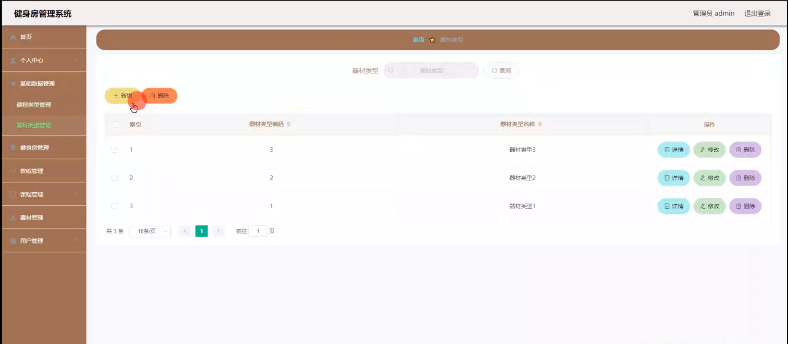

# 基于springboot+vue的健身房管理系统

---
### 👉作者QQ ：1556708905 微信：zheng0123Long (支持定制修改、部署调试、定制毕设)

### 👉接网站建设、小程序、H5、APP、各种系统等

---

#### 介绍

随着人们健康意识的提高，健身行业迅速发展，健身房的管理也变得日益复杂。为了提高健身房的运营效率和服务质量，我们开发了基于 Spring Boot 的健身房管理系统，以满足健身房管理者和用户的需求。

#### 技术栈

后端技术栈：Springboot+Mysql+Maven

前端技术栈：Vue+Html+Css+Javascript+ElementUI

开发工具：Idea+Vscode+Navicate

#### 系统功能介绍

（一）管理员角色  
个人中心：管理员可以在个人中心查看和修改个人信息，了解系统操作日志和接收重要通知。  
基础数据管理：维护系统运行所需的基础数据，如健身房的营业时间段、收费标准、会员等级设置等。  
健身房管理：对健身房的整体信息进行管理，包括健身房的地址、场地面积、设施分布等。  
教练管理：负责教练的招聘、培训、排班、绩效考核等，确保教练团队的专业素质和服务水平。  
课程管理：安排和调整各类健身课程，如瑜伽、普拉提、动感单车、搏击等，包括课程时间、授课教练、课程容量等。  
器材管理：对健身房内的器材进行登记、维护、报废处理等，掌握器材的使用情况和状态。  
用户管理：管理用户的信息，包括用户注册、会员办理、用户权限设置、用户消费记录等。  

（二）用户角色  
个人中心：用户在个人中心可以查看和修改个人资料，查看自己的健身记录、课程预约情况、消费明细等。  
健身房管理：了解健身房的基本信息，如营业时间、地址、设施介绍等。  
教练管理：查看教练的个人简介、授课风格、专业特长等，选择适合自己的教练。  
课程管理：浏览课程列表，根据自己的兴趣和时间预约课程。  
器材管理：查看器材的介绍和使用说明，了解器材的使用状态，合理安排自己的健身计划。  

#### 系统作用

提升管理效率  
自动化和规范化健身房的日常管理流程，减轻管理员的工作负担，提高工作效率。  
优化服务质量  
为用户提供便捷的信息查询和预约服务，提升用户体验，增加用户满意度和忠诚度。  
合理资源配置  
精确掌握教练、课程和器材的使用情况，实现资源的合理分配和有效利用。  
数据驱动决策  
通过对用户行为和业务数据的分析，为健身房的发展策略制定提供有力支持。  
增强竞争力  
借助先进的管理系统，提升健身房的品牌形象和市场竞争力，吸引更多的用户。  

#### 系统功能截图

代码结构

数据库表

登录

基础数据管理

健身房管理

教练管理

课程管理

器材管理

用户管理

用户端个人信息

#### 总结

基于 Spring Boot 的健身房管理系统，通过清晰的角色划分和丰富的功能模块，为健身房的管理者和用户提供了便捷、高效的服务。该系统有助于提高健身房的运营管理水平，满足用户的健身需求，推动健身行业的健康发展。

#### 使用说明

创建数据库，执行数据库脚本 修改jdbc数据库连接参数 下载安装maven依赖jar 启动idea中的springboot项目

后台登录页面
http://localhost:8080/jianshenfangguanli/admin/dist/index.html

管理员				账户:admin 		密码：admin

用户				账户:a1 		密码：123456